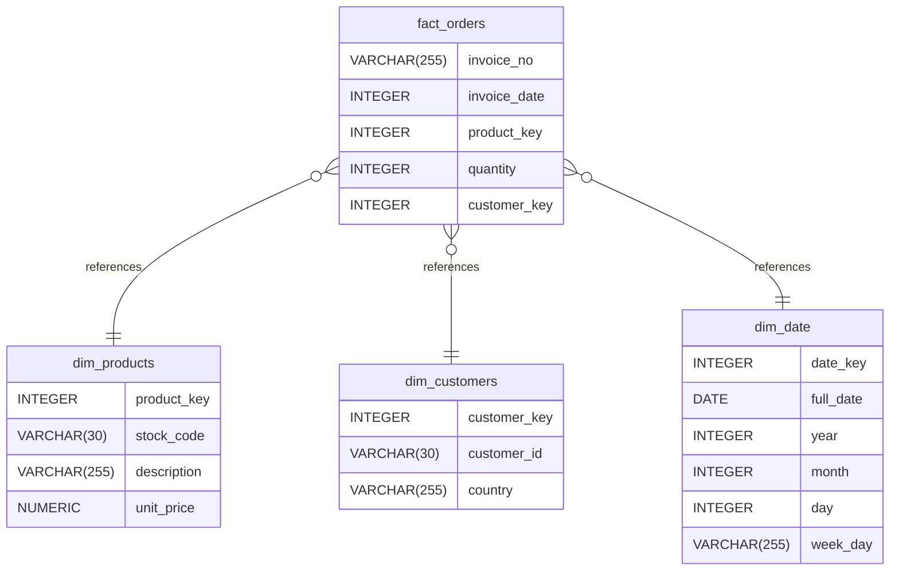

# BIS - Coding Exercise Data Analytics Engineer

## Installation Requirements

### Docker

Please install Docker on Linux or on Windows use Docker Desktop. For this version Docker Desktop has been used on Windows 11.

### GitHub

Please install git client on your local machine or go to github [https://github.com/lbica/exercises](https://github.com/lbica/exercises) and download the source code. For clone use the follwing command in command prompt:

`git clone https://github.com/lbica/exercises`

For building the solution I have used Visual Studio Code and Visual Studio 2022 for webapi-service. However if you can open the root folder on Visual Studio Code will works too.

## Solution/Project Structure

The solution consist of many folders that are built for difference goal. In the folowing section I will describe each directory.

### etl-service description

This service is the **ETL solution** for reading the input files (customers, products and order), apply the cleansing rules and load the currated data into a dimensional  model. However, in a real project the ingestion, cleansing/validation and results error including metadata  should be stored using a **Kimbal** approach with staging, core and mart layers or using a **Medalion** style: bronze, silver and gold layers.

etl-service is a restfull built using `Flask`  that exposes below mentioned methods. It consists of `app.py` script as entry point that implemented variuos validation types classified as following:

| Name               | Type            | Description                                                                                                     |
| -------------------- | ----------------- | ----------------------------------------------------------------------------------------------------------------- |
| `empty_column`     | validation rule | This rule eliminates the empty value of a given column and logs the errors in log file for keep trace and debug |
|                    |                 |                                                                                                                 |
| `invalid_datatype` | validation rule |                                                                                                                 |
| `negative_value`   | validation rule |                                                                                                                 
| `reference_entity`   | validation rule |                                                                                                                 References to other entities|

| Name               | Method Type            | Description                                                                                                     |
| -------------------- | ----------------- | ----------------------------------------------------------------------------------------------------------------- |
| `run_daily`     | POST | This runs products and customers validation and load the curated data  to postgres `dwh` database in `dim_products` and `dim_customers` tables. It. Other aditional validation hard rules can be added here.|
| `run_hourly`     | POST | This runs orders validation and load to posgres `dwh` database in `fact_orders` table. I eliminates the empty values, dupplicates, references to other entities (dim_customers, dim_products)|

The folder `data` consist of input data received by ftp or other upstream processes. This is the input for `app.py` script. in `sql/analytics.sql` you can find the sql statements reuired for this exercies. I have used pgAdmin4 for running Postgres sql statments and check the data

### Airflow description

In airflow folder I have created all required configuration and dag script to orchestrate our `etl-service`. If you want to see the current scheduled task (according with specification) you can access the airflow UI using the following connection properties. For more details about how to start the services in docker container please check the Docker Configuration section.

| Name         | Type   | Value                                                                                                                                 |
| -------------- | -------- | --------------------------------------------------------------------------------------------------------------------------------------- |
| `user`       | config | airflow                                                                                                                               |
| `pass`       | config | airflow                                                                                                                               |
| `web-ui-url` | config | [http://localhost:8080/](http://localhost:8080/)                                                                                      |

### webapi-service description

This service is built to handle the CRUD operations requests from users: postman, bruno or othe consumers. The application has been built using the ASP.Net Web API and `dotnet8` as SDK.
The application is runnign in a docker container and can be accssed at this url: [http://localhost:5163/swagger](http://localhost:5163/swagger). You can use swagger to test any CRUD operation. Please note that webapi-service it's using PostGres docker container as data storage.

**`Note`**: For handling exception I have created a GlobalExceptionErrorMiddleware and ResponseExcpetionFilter than handles all exceptions and present the result to the consumer in a JSON format. Please check below the payload of error json outcome. `Entity Framework` has been used as ORM Framework and `DTOs` objects for request/reponse data transfer. `Automapper` for mapping between DTos and Entities and viceversa.

## Docker Containers

According with specification the entire solution using docker for containerization. Each folder (project) has it's own Dockerfile used to built the image for a dedicated purpose: e.g etl-service,
webapi-service etc

### docker-compose.yml

In order thet all services to comunicate one each other I have used a `docker-compose` file (see in the root of the solution). This file consist of all services definition , enironment variable or other commands required for the appropitae service.  For running the docker-compose.yml file please check the below section

### Running the docker-compose.yml

Please follow the next steps in order to have all services up and running.

**`Important`**: Please check the Installation section before running. Docker must runs on the host machine.

1. open command prompt and go to the root application:

2. runs `docker-compose up --build -d`

after 1 min (please note that maybe will takes more time due the images must be downloaded from remote docker hub )

3. Please open the Docker Desktop or run docker ps. You should see all contaires in running state

4. Open a browser and navigate to [http://localhost:8080](https://localhost:8080). You should see now the Airflow Web Interface. Navigates to DAG and enable the cleasing and ingestion task for one of the entity. This will runs according with requiremetsL daily or hourly (for orders).

5. Go inside postgres docker comtainer or used `pgAdmin` and check the number of records for customers. You shoud  and empty table. After calling e.g. `http://localhost:5000/run_daily` on `etl-service` using `Postman` you shoud see the dim_pructs and dim_custoerms are loaded with cleansed data. Please note that `fact_orders` **is not yet compleetd due the time presures**

### PostGres

In order to conect to Postgres I have used `pgAdmin`

Use the `analytics.sql` file from `postgres\sql` folder to run analytics statement on Postgres.  

### Assets folder

This folders consists of `Dimensional Model` image and other images used inside **Readme.md** file.

## Dimensional Modeling

- [Database Type](#database-type)
- [Table Structure](#table-structure)
  - [dim_products](#dim_products)
  - [dim_customers](#dim_customers)
  - [dim_date](#dim_date)
  - [fact_orders](#fact_orders)
- [Relationships](#relationships)
- [Database Diagram](#database-Diagram)

### Database type

- **Database system:** Postgres

### Table structure

#### dim_products

| Name            | Type         | Settings                                | References | Note         |
| ----------------- | -------------- | ----------------------------------------- | ------------ | -------------- |
| **product_key** | INTEGER      | 🔑 PK, not null , unique, autoincrement |            |              |
| **stock_code**  | VARCHAR(30)  | not null , unique                       |            | Business key |
| **description** | VARCHAR(255) | not null                                |            |              |
| **unit_price**  | NUMERIC      | not null                                |            |              |

#### dim_customers

| Name             | Type         | Settings                                | References | Note         |
| ------------------ | -------------- | ----------------------------------------- | ------------ | -------------- |
| **customer_key** | INTEGER      | 🔑 PK, not null , unique, autoincrement |            |              |
| **customer_id**  | VARCHAR(30)  | not null , unique                       |            | Business key |
| **country**      | VARCHAR(255) | not null                                |            |              |

#### dim_date

| Name          | Type         | Settings                 | References | Note                              |
| --------------- | -------------- | -------------------------- | ------------ | ----------------------------------- |
| **date_key**  | INTEGER      | 🔑 PK, not null , unique |            | Format: YYYYMMDD (e.g., 20250330) |
| **full_date** | DATE         | not null , unique        |            | Business key                      |
| **year**      | INTEGER      | not null                 |            |                                   |
| **month**     | INTEGER      | not null                 |            |                                   |
| **day**       | INTEGER      | not null                 |            |                                   |
| **week_day**  | VARCHAR(255) | not null                 |            |                                   |

#### fact_orders

| Name             | Type         | Settings                      | References                                | Note               |
| ------------------ | -------------- | ------------------------------- | ------------------------------------------- | -------------------- |
| **invoice_no**   | VARCHAR(255) | 🔑 PK, not null               |                                           |                    |
| **invoice_date** | INTEGER      | 🔑 PK, not null               | fk_fact_orders_invoice_date_dim_date      | stored as YYYYMMDD |
| **product_key**  | INTEGER      | 🔑 PK, not null , default: -1 | fk_fact_orders_product_key_dim_products   |                    |
| **quantity**     | INTEGER      | not null                      |                                           |                    |
| **customer_key** | INTEGER      | 🔑 PK, not null , default: -1 | fk_fact_orders_customer_key_dim_customers |                    |

### Relationships

- **fact_orders to dim_products**: many_to_one
- **fact_orders to dim_customers**: many_to_one
- **fact_orders to dim_date**: many_to_one

### Database Diagram

